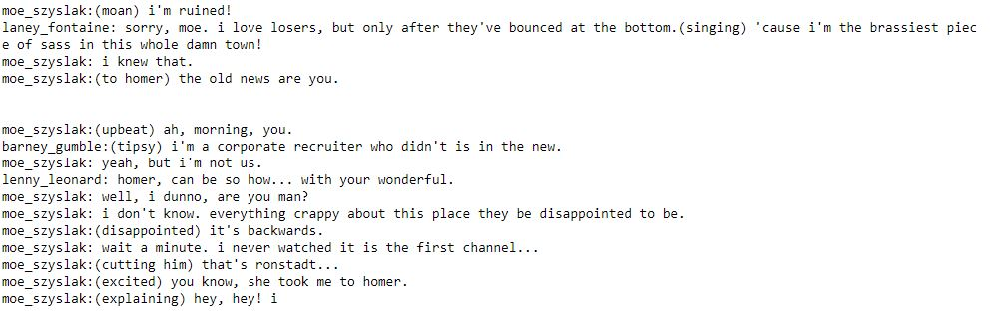

# Projec3: Generate TV Scripts (SIMPSONS) 

## Introduction
In this project, you'll generate your own Simpsons TV scripts using RNNs. You'll be using part of the Simpsons dataset of scripts from 27 seasons. The Neural Network you'll build will generate a new TV script for a scene at Moe's Tavern.

### To do: 
* Implement the following preprocessing f(): Lookup_tables (words to Ids) and tokenize_puntuation
* Implement: get_inputs 
* Implement: get_init_cell 
* Implement: get_embed 
* Build RNN: tf.nn.dynamic_rnn()
* build nn 
* implement get_batches 
* Hyperparameters 
* **TRAIN** AND **EVALUATE**
* get_tensors 
* pick_word 
* **GENERATE** **SCRIPTS**

## Advanced Projects
After completing this project, try applying what you learned to one of these problems.

Generate your own Bach music using like DeepBach.
Predict seizures in intracranial EEG recordings on Kaggle.

## Simpsons TVScript generated by RNN-LSTM v0:

# Feedback 
**get_embed** 
Good. You could have also written it as: return tf.contrib.layers.embed_sequence(input_data, vocab_size, embed_dim) 
**hyper-params** 
The number of epochs is set adequately, as the training loss is low and not improving much with more training.
Batch size is large enough to train efficiently, and it is obviously small enough to fit in memory.
RNN size seems adequate. 
Embed dim is in a good range. 
The sequence length seems too high. It should be around the size of the length of sentences you want to generate, and be around the average length of sentences in training data.
Learning rate looks fine. Not too large, not too small. 
**pick_word** 
You use deterministic strategy for picking words by choosing the words with the highest probability. You should consider implementing random approach (using probabilities parameter), otherwise the predictions will fall into a loop of the same words.
**script** 
Looks quite close. All the lines start with character names, and most of the sentences have proper punctuation.
The content should improve after you fix pick_word. 

## Simpsons TVScript generated by RNN-LSTM v1:

